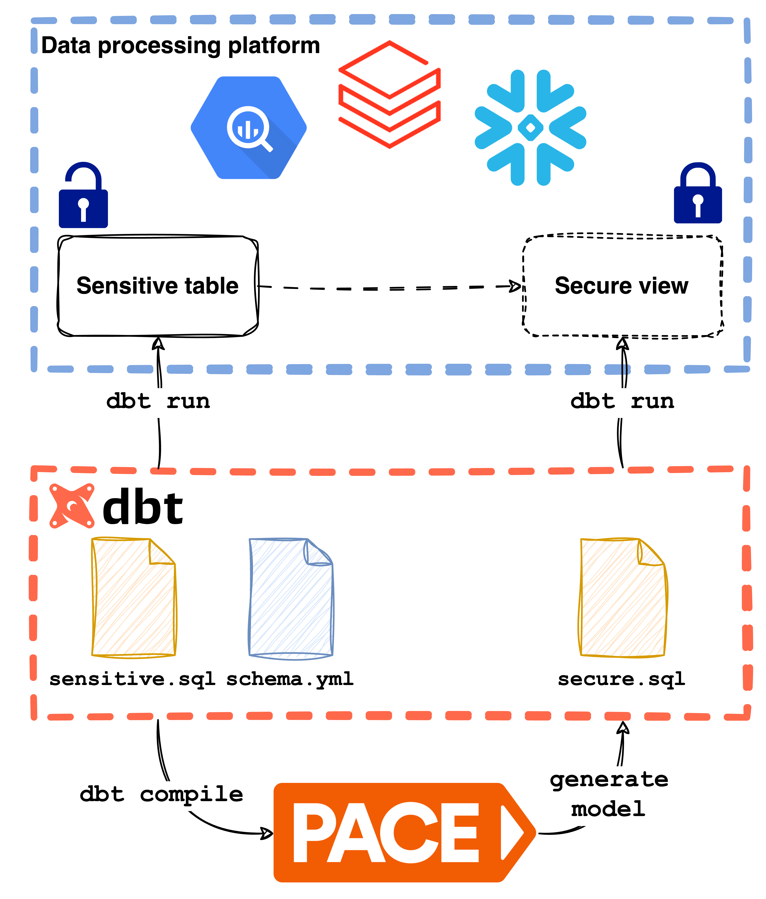

# Enforcing data access policies in dbt with PACE

When we released our first alpha version of PACE a couple of months ago, it was in the form of a
(Spring Boot) server application. Integrating with various data processing platforms, and pulling
metadata from a number of data catalogs, PACE started our journey towards open-source data access
policy management. Users can define data policies (column masks/transforms, row filters) in
a `yaml` format, and enforce them on their processing platform by using the PACE [CLI](https://github.com/getstrm/cli) (command line
interface), or alternatively the REST or gRPC API directly. Currently, PACE applies the policies by
generating platform-specific SQL statements that create secure views on the targeted platform, which in
their turn leverage native access controls to implement the desired access policy. Got a table with
with sensitive (customer) data? Let PACE create a (privacy-)safe view for it!


## When PACE met dbt
After putting PACE out to the public, we started getting similar feedback from people who shared one
thing: they used [dbt](https://www.getdbt.com/) for all their data processing needs. They were
wondering how PACE could fit in their picture. Dbt itself, after all, also is an abstraction layer
on top of databases and data processing platforms. Dbt users define _models_, which are essentially
SQL statements that translate to tables or views, but with the power of templating, allowing for
improved structuring and reuse of SQL code. Dbt also functions, to some extent, as a data catalog:
data owners can specify metadata about their models, and dbt projects inherently provide a
fairly extensive overview of all available data products, including lineage insights.




## Modularizing PACE for dbt support
So how does PACE fit in this picture? As a server application, PACE stores its data policies in its
own database, and directly connects to the different processing platforms. Running PACE in a
dbt-powered data landscape would not make sense, with both tools keeping track of metadata (e.g.
data policies) and integrating with data platforms (creating tables or views). Therefore, we soon
concluded to let dbt be responsible for the creation and updating of new relations (PACE's SQL
views), and reduce the scope of PACE to the generation of platform-specific SQL based on data policy
yaml specifications. All while minimizing the impact on a dbt user's existing workflow.

To this end, we started by modularizing PACE, extracting the SQL generation into a `core` module,
and putting everything related to running PACE as a Spring Boot application in a `server` module.
This opened the way to adding a `dbt` module, which would know how to generate dbt models
for PACE data policies, packaged and runnable as a simple executable. The dbt module works as
follows[^1]:

[^1]: we looked extensively at ways to blend PACE more into the execution of the `dbt compile` or
`dbt run` commands themselves, but dbt-core currently only offers SQL hooks for pre/post-actions.

1. A user adds PACE field transforms/filters to their existing `schema.yml` files, on model or
   column level, under dbt's `meta` sections (see the example below).
2. After a `dbt compile` or `dbt run`, dbt's `target/manifest.json` file is updated as usual,
   containing the project's complete configuration, including the PACE policy specifications.
3. The user runs the PACE dbt module (currently a Java jar file) from the dbt project's root, which
   results in the creation of additional model files, each containing the platform-specific SQL that
   implements the policy.
4. During the next `dbt run` execution, dbt creates the secure PACE views on the target platform.

With this approach, the data access policies reside as closely as possible to their respective model
metadata, becoming an integral part of the dbt project and workflow. Since both the policy
definitions and their implementations (the PACE models) are part of the same (version-controlled)
code base, the data access management process is transparent and explicit.


## How it works: an example
Let's look at a basic example with an imaginary "transactions" model. Here's the (
minimal) `schema.yml` file we'll enrich with a PACE data policy:

```yaml
version: 2

models:
  - name: dim_transactions
    columns:
      - name: transactionid
      - name: userid
      - name: email
      - name: age
      - name: transactionamount
      - name: brand
```

Let's say that we want to protect the data in the following way:

* The `userid` should be nullified for all users, except for administrators.
* The `email` should be masked to only show the domain, except for administrators.
* Administrators can see all records, but everyone else can only see records for users with an `age`
  greater than 18.

Then we can add the field transforms to their respective column metadata, and the filter rule to the
model's metadata:

```yaml
version: 2

models:
  - name: dim_transactions
    columns:
      - name: transactionid
      - name: userid
        meta:
          pace_transforms:
            # The administrator gets the original userid (identity).
            - principals: [ { group: administrator } ]
              identity: { }
            # Everyone else gets a null value.
            - principals: [ ]
              nullify: { }
      - name: email
        meta:
          pace_transforms:
            # Again, the administrator gets the original value.
            - principals: [ { group: administrator } ]
              identity: { }
            # Everyone else gets a partially masked email address using a regular 
            # expression transform.
            - principals: [ ]
              regexp:
                regexp: "^.*(@.*)$"
                replacement: "****$1"
      - name: age
      - name: transactionamount
      - name: brand
    meta:
      pace_rule_sets:
        - filters:
            - generic_filter:
                conditions:
                  # The "true" condition results in every row being shown to
                  # the administrators.
                  - principals: [ { group: administrator } ]
                    condition: "true"
                  # Everyone else only sees records where the age is greater than 18
                  - principals: [ ]
                    condition: "age > 18"
```

After a `dbt compile` and an execution of the PACE dbt module on the dbt project, a new dbt model is
generated. For a dbt project using databricks as data platform, the PACE dbt module will generate the following
dbt model:

```sql
{#
    This file was auto-generated by PACE. Do not edit this file directly.
#}
{{
    config(
      materialized='view',
      meta={'pace_generated': true}
    )
}}

select
  transactionid,
  case
    when (is_account_group_member('administrator')) then userid
    else null
  end userid,
  case
    when (is_account_group_member('administrator')) then email
    else regexp_replace('email', '^.*(@.*)$', '****$1')
  end email,
  age,
  transactionamount,
  brand
from {{ ref('stg_demo') }}
where case
  when (is_account_group_member('administrator')) then true
  else age > 18
end
```

On the next `dbt run` execution, dbt will create the view for this PACE model on the target platform.

> ℹ️ In this example we explicitly specified the field transforms. PACE server supports tag-based
transforms, let us know if you'd like to have those for PACE dbt too!

> ℹ️ For a more detailed overview on how to use PACE with dbt, see [our docs](https://pace.getstrm.com/docs/pace-dbt-module/getting-started).


## It's a wrap
That's all for now! We'd be happy to know what you think and what (missing) functionality would be most useful to your
(dbt) data workflow.

Reach out to us [on Slack](https://getstrm.com/slack) or [GitHub](https://github.com/getstrm/pace)
and join the discussion on open-source data security!
