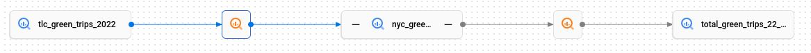
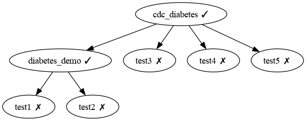

[bq-tut]: https://cloud.google.com/data-catalog/docs/how-to/track-lineage
[uci-diabetes]: https://archive.ics.uci.edu/dataset/891/cdc+diabetes+health+indicators
[wikipedia]: https://en.wikipedia.org/wiki/Data_lineage
# Lineage

Data entities (like tables, or table columns) have [_lineage_][wikipedia] which indicates where the data came from, and what is derived from this data. We use the terms
* 'upstream' to indicate some data that this data-entity was derived from
* 'downstream' data-entities that are derived from this one.

The concept of lineage is well known, and supported more or less by most data processing platforms and data-catalogs. Here's an example of a lineage view in BigQuery, taken from its [lineage tutorial][bq-tut]


# Lineage in PACE
PACE aims to
1. provide data-entity _lineage information_ of the various connected platforms in a unified manner. This information is available for all data-entities in the underlying platform, with or without a connected PACE data-policy.
2. provide _guidance_ to indicate which data entities might need a PACE data-policy, because they're in the lineage chain of a data-entity that is under control of a PACE data-policy.

## Lineage information of data-entities.
We've executed the above mentioned [BigQuery tutorial][bq-tut] on the `stream-machine-development` Google Cloud project, with BigQuery access configured in PACE under the `id` `bigquery-dev`.

```shell
pace list tables --processing-platform bigquery-dev \
  --database stream-machine-development \
  --schema data_lineage_demo -o json | jq -r '.tables[].name'
stream-machine-development.data_lineage_demo.nyc_green_trips_2021
stream-machine-development.data_lineage_demo.nyc_green_trips_2022
stream-machine-development.data_lineage_demo.total_green_trips_22_21
```
The responses are the platform _fully-qualified names_ that we use in the data-policy `source` references.

Here we show an annotated and somewhat simplified execution of the `get lineage` command.

```shell
#                                      PACE id               platform fully-qualified name
pace get lineage --processing-platform bigquery-dev stream-machine-development.data_lineage_demo.nyc_green_trips_2021
```

Responds with:
```yaml
lineage_summary:
  downstream:
  - resource_ref:
       fqn: stream-machine-development.data_lineage_demo.total_green_trips_22_21
    # the actual relation (in this case SQL) that causes the lineage
    relation: |-
      CREATE TABLE `stream-machine-development.data_lineage_demo.total_green_trips_22_21`
      AS SELECT vendor_id, COUNT(*) AS number_of_trips
      FROM (
           SELECT vendor_id FROM `stream-machine-development.data_lineage_demo.nyc_green_trips_2022`
           UNION ALL
           SELECT vendor_id FROM `stream-machine-development.data_lineage_demo.nyc_green_trips_2021`
      )
      GROUP BY vendor_id
  upstream:
  - resource_ref:
      fqn: bigquery-public-data.new_york_taxi_trips.tlc_green_trips_2021
    # the sql that copied this table from one of the public datasets.
    relation: |-
      CREATE TABLE `stream-machine-development.data_lineage_demo.nyc_green_trips_2021`
      COPY `bigquery-public-data.new_york_taxi_trips.tlc_green_trips_2021`;
```

## Scanning lineage
This process aims to find data-entities that might need a PACE data-policy that don't yet have one.
Scanning lineage works by
* scanning through the stored data-policies (within PACE), and finding the lineage information from the underlying processing platform data-entity.
* Then, for both upstream and downstream dependencies, PACE determines if those are under control of a data-policy.

We have set up a data-policy on a table named `cdc_diabetes` (from [UCI][uci-diabetes]). This table has various downstream dependencies in our environment, one of which is controlled by a data-policy (`stream-machine-development.dynamic_views.diabetes_demo`). Other up- and downstream data-entities are _not provided with a PACE data-policy_.

Note: we have shortened the string `stream-machine-development` to `dev` to keep the tabular output narrower.
```shell
pace list lineage --output table

Lineage information for connected processing platforms (✗ = not managed by PACE, ✓ = managed by PACE)
 FULLY QUALIFIED NAME             PLATFORM ID    UPSTREAM FQNS                        DOWNSTREAM FQNS

 dev.dynamic_views.diabetes_demo  bigquery-dev   dev.dynamic_views.cdc_diabetes (✓)   dev.dynamic_views.test1 (✗)
                                                                                      dev.dynamic_views.test2 (✗)
 dev.dynamic_views.cdc_diabetes   bigquery-dev                                        dev.dynamic_views.test3 (✗)
                                                                                      dev.dynamic_views.test4 (✗)
                                                                                      dev.dynamic_views.test5 (✗)
                                                                                      dev.dynamic_views.diabetes_demo  (✓)
```

The ✓ and ✗ symbols are just representations of the true/false values in the PACE api response; use `--output yaml` (or `json`) to get the full api response.

The goal is obviously to build a graph like display that will show all lineage, and highlight data-entities that probably should be controlled by a PACE data-policy.


