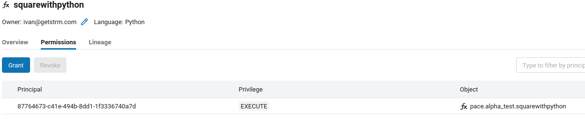

# User Defined Functions in Python

In this tutorial we will

* create a User Defined Function written in Python. We will use Databricks as a processing platform.
* create a Data Policy that uses this UDF, and apply it to the the platform.
* inspect the resulting SQL View.
* show some results.

## Creating the UDF

On Databricks this is [quite simple](https://docs.databricks.com/en/udf/python.html). In SQL we would do the following. Make sure we execute it in the catalog and schema of the data.

```sql
CREATE OR REPLACE FUNCTION squareWithPython(age INT)
RETURNS INT
LANGUAGE PYTHON
AS $$
return age*age
$$;
```

NOTE: Make sure both the PACE service credential, as well as any user that might access the resulting SQL VIEW on Databricks has `EXECUTE` permissions on the function. 

## Create a Data Policy

We have used a demo table with an `age` integer column in it, and downloaded a blueprint data policy:

```
pace get data-policy --blueprint --processing-platform dbr-pace pace.alpha_test.demo > policy.yaml
```

We have then edited the policy file, and included the following field transformation:

```yaml
metadata:
  ...
  version: 1
platform:
  id: dbr-pace
  platform_type: DATABRICKS
rule_sets:
- field_transforms:
  - field:
      name_parts: [ age ]
    transforms:
      - sql_statement: 
          statement: pace.alpha_test.squarewithpython(age)
        principals: []
  target:
    fullname: pace.alpha_test.demo_pace_view
source:
  ...
  ref: pace.alpha_test.demo
```

So this field transformation defines that any user (`principals: []`) receives the squared value of the `age` column.

## Create the SQL VIEW on Databricks

First `upsert` the policy file to PACE.

```
pace upsert data-policy policy.yaml
```

And then actually apply it on the processing platform (alternatively, you can execute the `upsert` command with the `--apply` flag to immediately apply it).

```
pace apply data-policy pace.alpha_test.demo  --processing-platform dbr-pace 
```

## Investigate the results

If everything went right we would have a SQL VIEW named `pace.alpha_test.demo_pace_view` with this view definition:

```sql
-- VIEW DEFINITION
select
    transactionId, userId, email, pace.alpha_test.squarewithpython(age) age,
    size, hairColor, transactionAmount, items, itemCount, date, purpose
    from pace.alpha_test.demo
```

The original `demo` table contains fairly normal ages:

```
select email, age from pace.alpha_test.demo limit 5;
email                     age
jeffreypowell@hotmail.com 33
forbeserik@gmail.com      16
wboone@gmail.com          64
oliverjulie@yahoo.com     12
debra64@hotmail.com       79
```

But the _view_ clearly shows them squared:

```
select email, age from pace.alpha_test.demo_pace_view limit 5;
email                     age
jeffreypowell@hotmail.com 1089
forbeserik@gmail.com      256
wboone@gmail.com          4096
oliverjulie@yahoo.com     144
debra64@hotmail.com       6241
```
